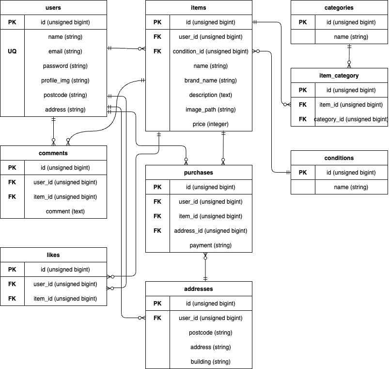

# coachtechフリマ
## Dockerビルド
- git clone git@github.com:kaochin42/fleamarket_app.git
- docker-compose up -d --build

## Laravel環境構築
- docker compose exec php bash
- composer install
- cp .env.example .env , 環境変数を適宜変更
  - STRIPE_KEY=StripeのPublishableKeyを設定
  - STRIPE_SECRET=StripeのSecretKeyを設定
- php artisan key:generate
- php artisan migrate
- php artisan db:seed
- php artisan storage:link

## テスト実行
- php artisan test

## 開発環境
- 商品一覧:http://localhost/
- ユーザー登録:http://localhost/register
- phpMyAdmin:http://localhost:8080/
- MailHog: http://localhost:8025/

## 使用技術（実行環境）
- PHP 8.1.34
- Laravel 8.83.29
- nginx 1.21.1
- MySQL 8.0
- MailHog
- Stripe

## ER図

